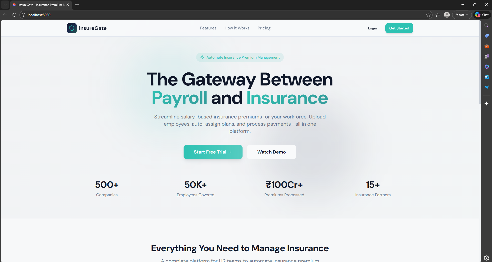
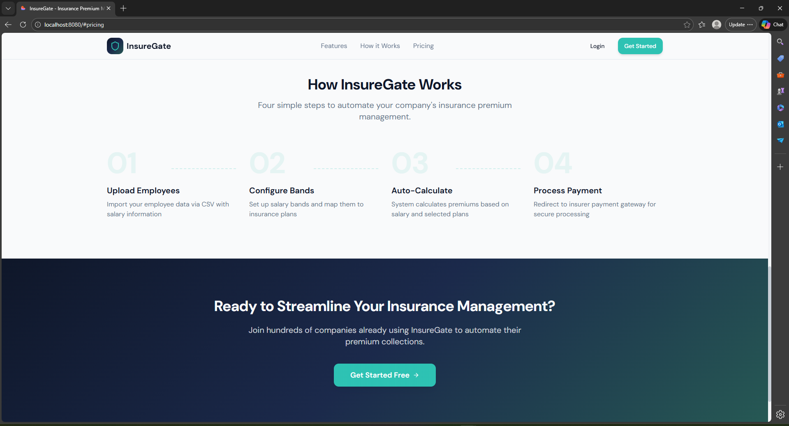
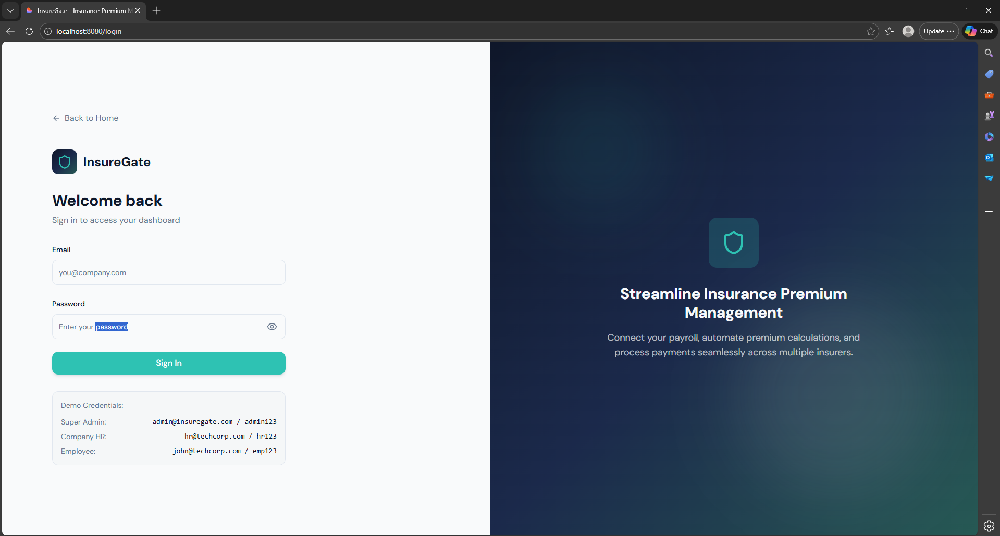

# B2B Dashboard Platform (Mock)

📊 A **mock responsive web application** inspired by modern B2B fintech dashboards like Razorpay, Gusto, and Rippling, designed to simulate enterprise workflows for admins and employees.

---

## 🚀 Project Overview
This project is a fully functional **frontend mock platform** for multi-tenant insurance management. It demonstrates **role-based dashboards**, interactive UI, and responsive design for desktop and mobile screens.

The platform is designed to be:  
🔒 **Secure** (role-based access simulation)  
⚙️ **Scalable** (component-based architecture)  
🧩 **Modular** (clean, reusable React components)  
🛡 **User-friendly** (modern UI/UX with smooth transitions)

---

## ✅ Key Features
- 👥 **Role-Based Dashboards**: Super Admin, Company Admin, Employee  
- 📄 **Employee CSV Upload**: Bulk import employee data for plan management  
- 🗂 **Plan Mapping**: Assign and manage insurance plans  
- 🧑‍💼 **Employee Portal**: View assigned plans, add dependents, and explore workflows  
- 📊 **Dynamic Premium Summary**: View summaries of premiums and plan selections  
- 📱 **Responsive Design**: Works seamlessly across desktop and mobile  
- 🎨 **Clean, Modern UI**: Card-based layouts, subtle shadows, and teal/navy palette  

---

## 🛠 Tech Stack
- **React** – Frontend framework  
- **HTML & CSS** – Styling and responsive layout  
- **API Integration (Mock)** – Simulated dynamic content  
- **Component-Based Architecture** – Reusable, modular UI components  

---

## 📸 Screenshots

### Landing Page


### Another view


### Login Page


## 📫 How to Run
```bash
# 1. Clone the repo
git clone https://github.com/your-username/b2b-dashboard-platform.git

# 2. Navigate to the folder
cd b2b-dashboard-platform

# 3. Install dependencies
npm install

# 4. Start the project
npm start
>>>>>>> db13790 (Add screenshots and update README)
